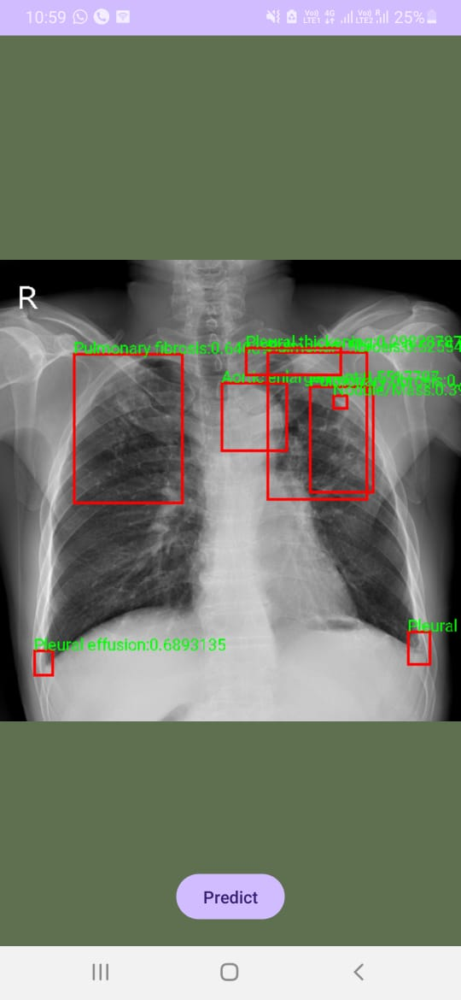
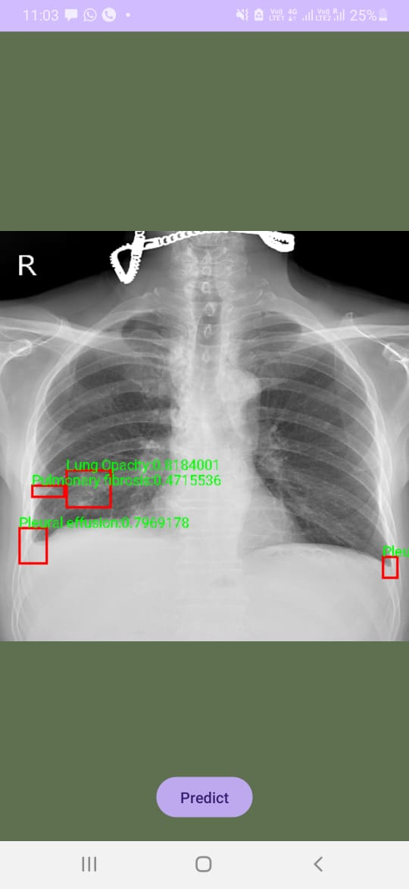

# Lung Abnormality Detection
<p align="center">
  
  
</p>
## Overview

Lung diseases pose a significant global health challenge, demanding prompt and accurate diagnoses for effective treatment and improved patient outcomes. This project leverages advanced deep learning technologies, specifically Convolutional Neural Networks (CNNs) integrated with the Faster R-CNN (Region-based Convolutional Neural Network) framework, to enhance precision in lung disease detection from chest X-ray images.

## System Architecture

### Data Collection and Preprocessing

The foundation of this system lies in a comprehensive dataset of labeled chest X-ray images. These images span a wide spectrum of lung conditions, patient demographics, and variations in imaging quality to ensure the model's robustness. The preprocessing steps include:

1. **Standardizing Image Dimensions:** Ensures all input images have consistent dimensions.
2. **Normalizing Pixel Values:** Normalizes the pixel values for consistency across the dataset.
3. **Data Augmentation:** Applies techniques such as rotation, flipping, and scaling to enhance dataset diversity and improve model generalization.

### Model Architecture

The system architecture is based on Faster R-CNN, comprising the following key components:

1. **Feature Extraction:** Utilizing ResNet-50 as the backbone network to extract hierarchical features from the input chest X-ray images.
2. **Region Proposal Network (RPN):** Generates region proposals or candidate bounding boxes that may contain lung abnormalities.
3. **RoI Pooling:** Extracts equal-length feature vectors from all region proposals.
4. **Object Detection:** Classifies and refines the proposals to accurately detect and localize lung abnormalities.

## Getting Started

### Prerequisites

Ensure you have the following installed:

- Python 3.x
- PyTorch
- torchvision
- OpenCV
- pandas
- numpy
- seaborn
- matplotlib
- albumentations
- pydicom

### Installation

Clone the repository and install the required packages:

```bash
git clone https://github.com/yourusername/lung-disease-detection.git
cd lung-disease-detection
pip install -r requirements.txt
```

### Usage

1. **Data Preparation:**
   - Download and organize the chest X-ray dataset.
   - Preprocess the images using the provided scripts.

2. **Training:**
   - Train the Faster R-CNN model using the preprocessed dataset.
   - Monitor the training progress via the loss vs. epoch graph.

```bash
python train.py --data_dir /path/to/dataset --output_dir /path/to/save/models
```

3. **Evaluation:**
   - Evaluate the trained model on a validation set to assess its performance.

```bash
python evaluate.py --model_dir /path/to/saved/models --data_dir /path/to/validation/dataset
```

### Results

The training progress can be monitored through the loss vs. epoch graph. As training progresses, a decreasing and stabilizing loss indicates effective learning. Challenges and anomalies encountered during training are addressed to ensure model robustness.

## Contributing

Contributions are welcome! Please fork the repository and submit pull requests for any enhancements or bug fixes.

## License

This project is licensed under the MIT License. See the [LICENSE](LICENSE) file for details.
